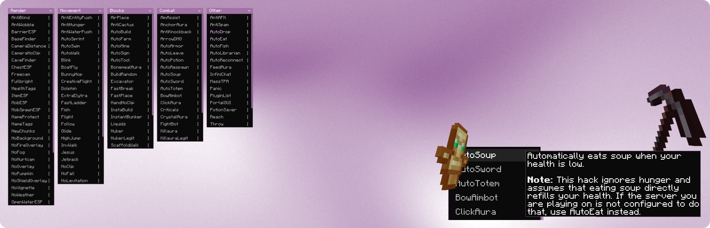
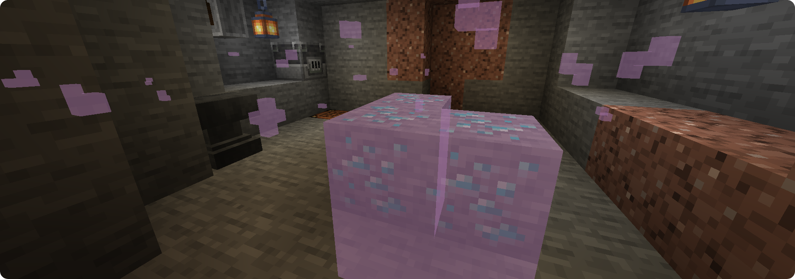
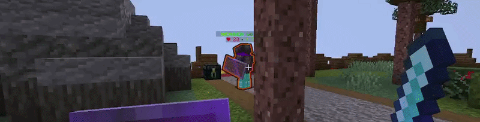
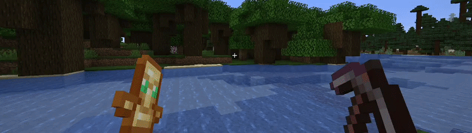
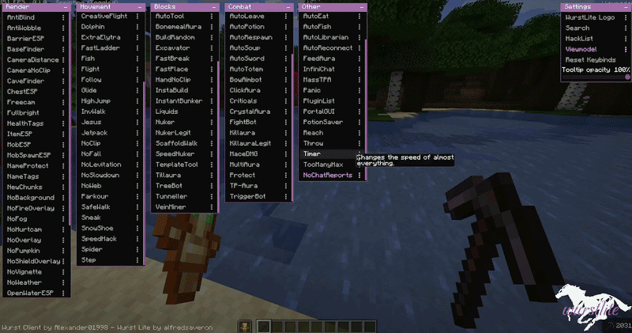
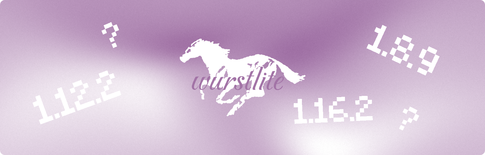

# Wurst Lite


<p align="center">
  <a href="https://fabricmc.net/"></a>
  <a href="https://github.com/alfredsaveron/wurst-lite"></a>
</p>

> [!IMPORTANT]
> Wurst Lite is an experimental, open-source hobby project created for fun, with absolutely no expectation of profit or financial income.

> [!WARNING]
> Using hacked clients on public Minecraft servers ruins the fun for other players and creates an unfair playing field. We strongly advise against using **Wurst Lite** on public multiplayer servers. If you wish to use it in multiplayer, it is best done on private servers with consent from your friends.
> 
> Furthermore, most popular modern public servers (such as **Hypixel**) utilize highly sophisticated anti-cheat systems. Attempting to play on these networks with Wurst Lite will likely result in an immediate and permanent ban.

A clean, lightweight fork of the Wurst Client for Minecraft 1.21.1. Wurst Lite is a project started to modernize the highly popular Wurst Client, optimized to provide essential cheat features with a sleek interface, reduced bloat, and improved performance.

## Key Features

* **ClickGUI**: Features equalized category window widths, scroll support, minimize buttons, and fixed overlap layouts.
* **Search**: Inline search bar integrated directly into the GUI to find and toggle hacks quickly.
* **PlayerESP**: Glow and outline rendering with dynamic color adjustments.
* **FreeLook**: Added free look camera with smooth interpolation and adjustable distance modifiers.
* **Bloat Removed**: Cleaned up bloated legacy utilities (e.g., fancy chat, autocompletes, default keybinds) and added a clean `WurstLite` chat prefix.




## Why Wurst Lite?

> [!CAUTION]
> Do not trust Wurst Lite downloads from other sources or third-party `.jar` files. This repository is the only official and safe source for Wurst Lite. I am not responsible for any security issues or damage caused by builds obtained elsewhere.

Having used the Wurst Client since childhood to troll friends with excitement, I have always admired its years of continuous development and evolution. Seeing it actively updated today inspired me to start this modernization project, keeping that classic legacy alive in a modern, refined way.





## Installation

Wurst Lite can be installed like any standard Fabric mod:

1. Run the Fabric installer for Minecraft **1.21.1**.
2. Download and place the **Wurst Lite** jar and **Fabric API** in your `.minecraft/mods` folder.
3. Launch Minecraft using the Fabric profile.

*Note: A licensed copy of Minecraft Java Edition is required.*

## Future Updates



I am not entirely sure about the long-term continuity of this project; I plan to maintain it as long as I find it fun and enjoy working on it. I also hope to release updates for both older and newer Minecraft versions over time, so feel free to check back on this repository occasionally!

## Development Setup

Ensure you have **Java Development Kit 21** installed.

### Workspace Setup

1. Clone the repository:
   ```pwsh
   git clone https://github.com/alfredsaveron/wurst-lite.git
   cd wurst-lite
   ```

2. Generate the resources for your preferred IDE:

   * **VSCode / Cursor:**
     ```pwsh
     ./gradlew genSources vscode
     ```
   * **IntelliJ IDEA:**
     ```pwsh
     ./gradlew genSources idea --no-configuration-cache
     ```
   * **Eclipse:**
     ```pwsh
     ./gradlew genSources eclipse
     ```

## Wurst Client


<p align="center">
  <a href="https://ko-fi.com/wurst"></a>
  <a href="https://www.paypal.com/biz/fund?id=FDQ7BMPSLHPBJ"></a>
</p>

For documentation, community assistance, and upstream codebases, refer to these references:

* **Official Website:** [wurstclient.net](https://www.wurstclient.net/)
* **Official Wiki & Docs:** [wurst.wiki](https://wurst.wiki/)
* **Upstream Wurst7 Repository:** [github.com/Wurst-Imperium/Wurst7](https://github.com/Wurst-Imperium/Wurst7)
* **Official Wurst Forum:** [wurstforum.net](https://wurstforum.net/)
* **Fabric Modding Toolchain:** [fabricmc.net](https://fabricmc.net/)

## License

This project is licensed under the GNU General Public License v3.

On a personal note, I want to thank Alexander01998 for maintaining the Wurst Client with so much passion and effort for all these years. Wurst has been a huge part of my childhood and Minecraft journey.
